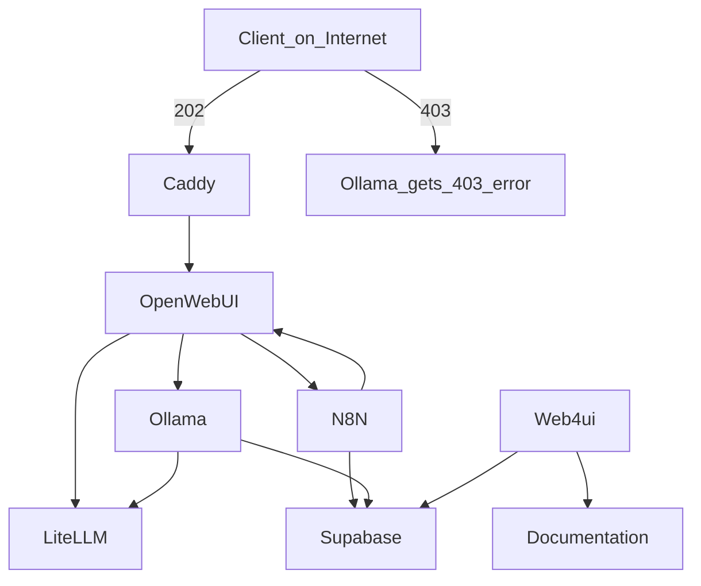

# AI-Services ㊙️ 😶‍🌫️

### Inspired from these sites:
<br>
Collected over time:<br><br>
Host your own Local AI <br>
🎥 (https://www.youtube.com/watch?v=E2GIZrsDvuM)
<br><br>


# Installation

**Prerequisites**

- **Docker Desktop**
- **Python 3.8** or newer
- **Git 2.27** or newer

**Install Copier**

On Linux:
```
python3 -m pip install --user pipx
python3 -m pipx ensurepath
pipx install copier
```

Note that you probably need to start another terminal after installing ``pipx`` to make the pipx command available.

**Create a Folder for the Docker Stack**

If you keep all you docker stacks in a directory like $HOME/docker-stacks, you can use the following commands to create the Llama Tunnel stack in a new sub-directory.

macOS and Linux:
````
STACK_DIR="$HOME/docker-stacks/ai-services"
mkdir -p $STACK_DIR
cd $STACK_DIR
````

**Create a Data Directory for cloudflared**

````
mkdir -p ./data/flowise ./data/n8n/backup \
 ./data/apip \
 ./data/functions \
 ./data/flowise \
 ./data/postgres_storage \
 ./data/n8n/backup/workflows \
 ./logs/ \
 ./data/shared \
 ./data/qdrant_storage \
 ./data/kong/api \
 ./data/supabase/imageproxy/storage \
 ./data/supabase/vector/logs \
 ./data/supabase/pooler \
 ./data/supabase/storage \
 ./data/supabase/edge/functions 

````

**Create the Project from the Template**

Create the project from the template with copier and answer the questions. If you forgot the tunnel id, you can find it in the data/cloudflared/credentials.json file or see it with cloudflared tunnel list.
````
copier copy gh:bozman2021/ai-services .
````

This will create a new directory in the STACK_DIR with the all the files necessary to run the tunnel.


**Start the Services**

Change into the project directory and start the services in the foreground:

````
docker compose up --build
````
_in detached mode_

````
docker compose up --build -d
````
Easy chart over dependecies.
(https://mermaid.js.org/#/)<br>


